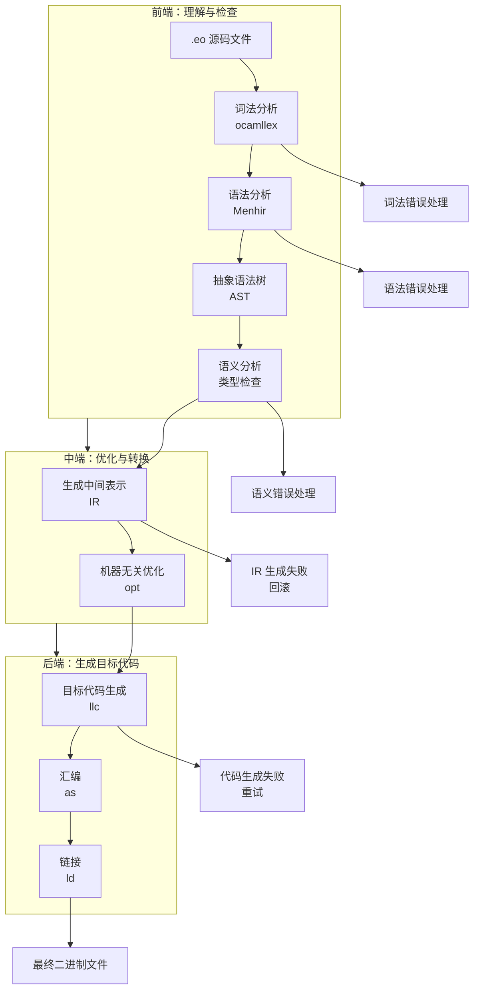

# UC-002-编译器技术流程映射

## 1. 主流程

```
.eo 源码文件 → 词法分析 → 语法分析 → 抽象语法树 → 语义分析 → 生成中间表示 → 机器无关优化 → 目标代码生成 → 汇编 → 链接 → 最终二进制文件
```

### 流程说明
- **起点**: 开发者编写的 .eo 源文件（Echo 语言源代码）
- **词法分析**: 使用 ocamllex 或 Sedlex 将字符流分解为 Token 序列（关键字、标识符、运算符等）
- **语法分析**: 使用 Menhir 根据 BNF 语法规则将 Token 序列构建为具体语法树 (CST)
- **抽象语法树**: 将 CST 转换为更精简的抽象语法树 (AST)，定义在 ast.ml 中的 OCaml 类型
- **语义分析**: 遍历 AST 进行作用域分析、类型推断与检查、定义-使用检查，为后续优化打基础
- **生成中间表示**: 将装饰后的 AST 转换为中间表示（IR），可以选择 OCaml Lambda IR、LLVM IR 或自定义 IR
- **机器无关优化**: 在 IR 层面进行常量传播、死代码消除、内联、循环优化等机器无关优化
- **目标代码生成**: 将优化后的 IR 转换为特定 CPU 架构的汇编代码（如 x86_64 或 ARM）
- **汇编**: 调用系统汇编器（如 as）将汇编代码转换为目标文件 (.o)
- **链接**: 调用系统链接器（如 ld）将目标文件、Echo 运行时库、GC、智能体调度器与系统库链接为最终二进制
- **终点**: 可执行的二进制文件，可以直接运行或作为库使用

## 2. 分支流程

### 2.1 异常处理流程
**触发条件**: 编译过程中出现语法错误、类型错误、语义错误或其他编译时错误
**处理方式**:
```
检测到编译错误 → 收集错误信息（位置、类型、描述） → 生成友好的错误提示 → 提供修复建议 → 终止编译流程 → 返回错误码
```

### 2.2 优化决策流程
**触发条件**: 编译器需要决定是否应用特定优化以及优化级别
**处理方式**:
```
分析代码特征 → 检查编译选项 → 评估优化收益 → 应用相应优化 → 生成优化报告（可选）
```

### 2.3 重试流程
**触发条件**: 临时性失败，如外部工具调用失败、网络超时、资源不足
**处理方式**:
```
检测失败类型 → 判断是否可重试 → 指数退避等待 → 重新执行失败步骤 → 达到最大重试次数后报错
```

### 2.4 回滚流程
**触发条件**: 关键编译步骤失败，需要清理已生成的临时文件和中间产物
**处理方式**:
```
检测步骤失败 → 停止后续处理 → 清理临时文件 → 清理中间产物 → 返回错误状态
```

## 3. 定时任务

### 3.1 每日任务
- **清理临时文件**: 删除编译过程中生成的 .ll、.s、.o 等临时文件
- **编译缓存清理**: 清理过期的 AST 缓存和符号表缓存
- **性能监控报告**: 生成编译性能统计报告，包括各阶段耗时、内存使用等

### 3.2 每周任务
- **编译器性能分析**: 分析编译器的性能瓶颈，优化热点代码路径
- **依赖更新检查**: 检查 OCaml、LLVM 等外部依赖是否有安全更新
- **错误统计分析**: 分析用户遇到的常见编译错误，改进错误提示

### 3.3 每月任务
- **编译器健康检查**: 运行完整的测试套件，确保编译器功能正常
- **资源使用审计**: 审计编译过程中的资源使用情况，识别潜在的内存泄漏
- **生态系统兼容性测试**: 测试与不同版本的 OCaml、LLVM、系统库的兼容性

## 4. 流程图



---

## 检查清单

- [x] 主流程是否清晰？（起点、步骤、终点）
- [x] 分支流程是否识别完整？（异常、优化决策、重试、回滚）
- [x] 定时任务是否识别完整？（每日、每周、每月）
- [x] 流程图是否清晰？（包含前端、中端、后端三个阶段）

---

## 技术栈分工说明

### OCaml 的作用：编译器的大脑（前端+中端）
- **词法分析**: 使用 ocamllex 编写词法规则
- **语法分析**: 使用 Menhir 编写 BNF 语法规则
- **AST 处理**: 在 OCaml 中定义和操作 AST
- **语义分析**: OCaml 代码遍历 AST 进行类型检查
- **IR 生成**: 调用 LLVM OCaml 绑定生成 LLVM IR

### Clang/LLVM 的作用：编译器的肌肉（中端+后端）
- **IR 优化**: opt 工具进行机器无关优化
- **代码生成**: llc 将 IR 转换为目标架构汇编
- **汇编驱动**: clang 调用系统汇编器生成目标文件
- **链接驱动**: clang 调用系统链接器生成最终二进制

---

## 下一步

完成编译器技术流程映射后，可以基于此流程进行用例识别和架构设计，为 Echo 语言编译器的实现奠定基础。

