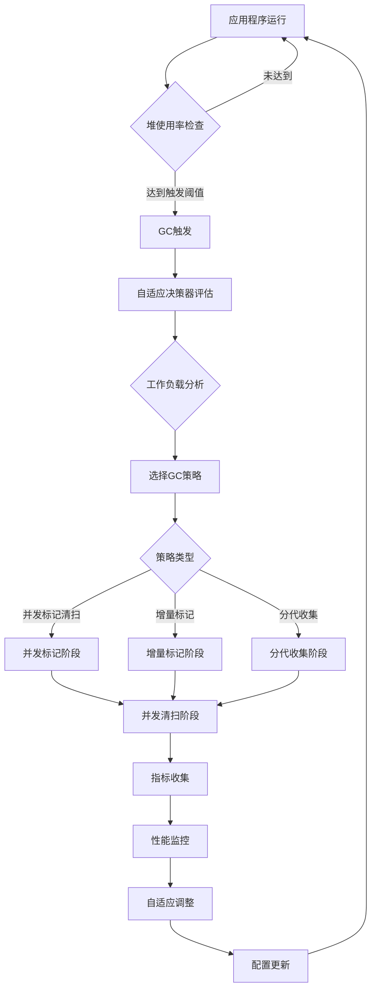

# GC业务流程

## 1. 流程概述
- **流程ID**: GC-001
- **业务目标**: 实现高效、可预测的内存垃圾回收，确保应用程序性能和稳定性
- **参与角色**: GC调度器、标记器、清扫器、自适应控制器、监控系统
- **关键指标**: 暂停时间 < 10ms，吞吐量损失 < 5%，内存开销 < 20%

## 2. 主GC流程图

## 3. 步骤详述
| 步骤 | 活动描述     | 主责角色     | 输入                   | 输出     | 成功标准          |
| ---- | ------------ | ------------ | ---------------------- | -------- | ----------------- |
| 1    | 堆使用率监控 | GC调度器     | 堆使用统计             | 触发信号 | 监控延迟 < 1ms    |
| 2    | GC策略选择   | 自适应决策器 | 工作负载特征、性能指标 | GC配置   | 决策时间 < 100μs  |
| 3    | 并发标记     | 标记器       | 根对象集合             | 标记位图 | 标记准确率 100%   |
| 4    | 并发清扫     | 清扫器       | 标记位图               | 空闲内存 | 回收率 > 95%      |
| 5    | 性能监控     | 监控系统     | GC执行数据             | 性能指标 | 监控开销 < 1%     |
| 6    | 自适应调整   | 自适应控制器 | 性能指标               | 配置参数 | 参数收敛时间 < 1s |

## 4. 分支流程

### 4.1 紧急GC流程
**触发条件**: 堆使用率 > 95% 或分配失败
**处理流程**:
1. 立即触发STW（Stop-The-World）GC
2. 强制回收所有可达对象
3. 如果仍然不足，抛出OutOfMemory异常

### 4.2 增量GC流程
**触发条件**: 目标暂停时间 < 5ms 的实时应用
**处理流程**:
1. 将GC工作分散到多个时间片
2. 每次只处理部分对象
3. 保持应用响应性

### 4.3 分代GC流程
**触发条件**: 年轻代对象比例 > 70%
**处理流程**:
1. 优先收集年轻代对象
2. 定期晋升存活对象到老年代
3. 降低整体GC频率

## 5. 异常处理流程

### 5.1 GC失败处理
**异常类型**: 标记阶段失败、清扫阶段失败
**处理策略**:
1. 记录详细错误信息
2. 尝试降级到保守GC模式
3. 如果无法恢复，触发紧急堆转储

### 5.2 性能退化处理
**异常类型**: GC暂停时间超出目标
**处理策略**:
1. 启用增量GC模式
2. 降低并发度
3. 调整堆大小限制

## 6. 监控点
- **GC触发频率**: 每分钟触发次数
- **平均暂停时间**: P50、P95、P99
- **堆使用率变化**: 分配率、回收率
- **CPU开销**: GC线程CPU使用率
- **内存开销**: GC元数据大小
