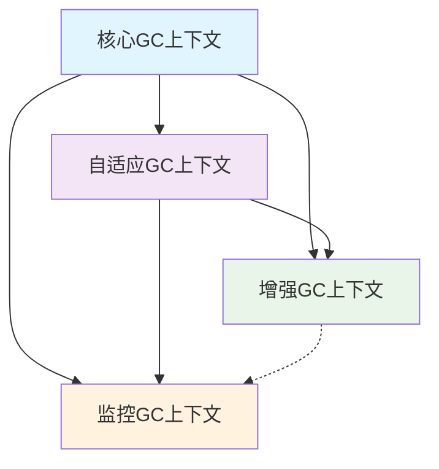

# GC限界上下文定义

## 1. 上下文识别与定义

基于聚合分析和领域事件分析，自然形成以下限界上下文：

### 1.1 核心GC上下文 (Core GC Context)
**核心职责**：提供基本的并发标记清扫GC功能
- **包含聚合**：GarbageCollector, Heap
- **核心功能**：并发标记清扫、内存分配、基本回收
- **技术实现**：Go风格三色标记、混合写屏障、精确扫描
- **部署属性**：必须存在，与应用程序生命周期一致

### 1.2 自适应GC上下文 (Adaptive GC Context)
**核心职责**：根据运行时指标智能调整GC策略
- **包含聚合**：AdaptiveController
- **核心功能**：工作负载检测、规则引擎、PID控制、配置调整
- **技术实现**：基于规则的启发式、自适应算法、统计预测
- **部署属性**：可选加载，可独立部署和扩展

### 1.3 增强GC上下文 (Enhanced GC Context)
**核心职责**：提供高级GC特性，按需启用
- **包含聚合**：GenerationalModule, IncrementalModule, CompactionModule
- **核心功能**：分代收集、增量标记、内存压缩、NUMA感知等
- **技术实现**：模块化架构、动态加载、配置驱动
- **部署属性**：插件化，按需加载，不影响核心功能

### 1.4 监控GC上下文 (Monitoring GC Context)
**核心职责**：提供GC监控、诊断和可观测性
- **包含聚合**：MonitoringService, DiagnosticsService
- **核心功能**：性能指标收集、异常检测、诊断报告、告警通知
- **技术实现**：指标收集、时间序列分析、日志聚合、可视化面板
- **部署属性**：可选部署，可独立扩展监控能力

## 2. 上下文边界分析

### 2.1 核心GC上下文边界
**职责范围**：
- ✅ 基本的并发标记清扫算法
- ✅ 三色标记和写屏障实现
- ✅ 内存分配和基本回收
- ✅ GC周期管理和状态转换

**不负责**：
- ❌ 智能策略选择（自适应上下文）
- ❌ 高级回收算法（增强上下文）
- ❌ 监控和诊断（监控上下文）
- ❌ 配置管理和模块加载

**边界理由**：核心GC是GC系统的基石，必须保持简单、高效、可靠。任何复杂功能都会影响核心性能。

### 2.2 自适应GC上下文边界
**职责范围**：
- ✅ 工作负载特征分析
- ✅ 自适应规则执行
- ✅ 配置参数动态调整
- ✅ 模块启用/禁用决策

**不负责**：
- ❌ 具体的GC算法执行（核心上下文）
- ❌ 高级回收算法实现（增强上下文）
- ❌ 监控数据收集（监控上下文）
- ❌ 模块的具体功能实现

**边界理由**：自适应控制是独立的决策系统，需要根据运行时指标做出决策，与具体GC实现解耦。

### 2.3 增强GC上下文边界
**职责范围**：
- ✅ 分代收集算法
- ✅ 增量标记实现
- ✅ 内存压缩算法
- ✅ 其他高级GC特性

**不负责**：
- ❌ 基础GC算法（核心上下文）
- ❌ 策略决策（自适应上下文）
- ❌ 监控和诊断（监控上下文）
- ❌ 模块管理和生命周期

**边界理由**：增强功能是可选的扩展，需要保持模块化，不影响核心GC的稳定性和性能。

### 2.4 监控GC上下文边界
**职责范围**：
- ✅ 性能指标收集和存储
- ✅ 异常情况检测和告警
- ✅ 诊断信息生成和报告
- ✅ 可观测性数据提供

**不负责**：
- ❌ GC算法执行（核心上下文）
- ❌ 策略调整（自适应上下文）
- ❌ 具体GC特性实现（增强上下文）
- ❌ 配置管理和模块控制

**边界理由**：监控是横切关注点，应该独立演化，不耦合到GC核心逻辑中。

## 3. 上下文关系与集成模式

### 3.1 上下文依赖关系图


### 3.2 集成模式分析

#### 核心GC → 自适应GC (Customer-Supplier关系)
- **集成模式**：事件驱动 + 直接调用
- **通信方式**：
  - 核心GC发布GCCycleCompleted事件
  - 自适应GC订阅事件进行分析
  - 自适应GC通过接口调用核心GC进行配置调整
- **数据格式**：性能指标DTO、配置参数对象
- **耦合度**：中度耦合（策略依赖但实现独立）

#### 核心GC → 增强GC (插件关系)
- **集成模式**：模块接口 + 依赖注入
- **通信方式**：
  - 增强GC实现标准模块接口
  - 核心GC通过依赖注入加载模块
  - 运行时回调模块生命周期方法
- **数据格式**：模块配置、GC上下文
- **耦合度**：低耦合（接口契约驱动）

#### 核心GC → 监控GC (观察者关系)
- **集成模式**：事件驱动（单向）
- **通信方式**：
  - 核心GC发布各种GC事件
  - 监控GC订阅事件进行收集和分析
- **数据格式**：事件载荷、指标数据
- **耦合度**：松耦合（事件契约）

#### 自适应GC → 增强GC (协调关系)
- **集成模式**：命令模式
- **通信方式**：
  - 自适应GC根据决策发送启用/禁用命令
  - 增强GC执行命令并反馈结果
- **数据格式**：模块命令、执行结果
- **耦合度**：中度耦合（功能协作）

### 3.3 上下文映射表

| 上下文关系        | 映射类型                  | 集成技术  | 通信频率 | 一致性要求 |
| ----------------- | ------------------------- | --------- | -------- | ---------- |
| 核心GC ↔ 自适应GC | Customer-Supplier         | 事件+接口 | 中等     | 最终一致性 |
| 核心GC → 增强GC   | Separate Ways → Open Host | 模块接口  | 低       | 强一致性   |
| 核心GC → 监控GC   | Published Language        | 事件      | 高       | 最终一致性 |
| 自适应GC → 增强GC | Customer-Supplier         | 命令      | 低       | 强一致性   |

## 4. 上下文演化规划

### 4.1 版本演化策略
- **核心GC上下文**：稳定演化，谨慎引入变更
- **自适应GC上下文**：快速迭代，算法优化
- **增强GC上下文**：模块化扩展，新功能独立开发
- **监控GC上下文**：持续增强，跟随可观测性需求

### 4.2 拆分与合并策略
- **拆分触发条件**：上下文变得过于复杂（职责过多）
- **合并触发条件**：上下文之间频繁交互，边界模糊
- **迁移策略**：版本并存，逐步迁移，保持兼容性

### 4.3 团队组织映射
- **核心GC团队**：核心GC算法和实现的维护
- **自适应GC团队**：智能调优算法和策略优化
- **增强GC团队**：高级GC特性的开发
- **监控GC团队**：可观测性和诊断系统的开发

## 5. 上下文质量评估

### 5.1 设计原则符合性
- ✅ **单一职责**：每个上下文职责清晰
- ✅ **独立演化**：上下文间松耦合
- ✅ **业务对齐**：上下文边界符合业务需求
- ✅ **技术可行**：集成模式技术可实现

### 5.2 架构优势验证
- ✅ **可维护性**：问题定位到具体上下文
- ✅ **可扩展性**：新功能可独立开发
- ✅ **可测试性**：上下文可独立测试
- ✅ **部署灵活性**：可独立部署和扩展

### 5.3 风险评估
- ⚠️ **集成复杂度**：多上下文集成需要精心设计
- ⚠️ **一致性保证**：跨上下文操作的一致性需要特殊处理
- ⚠️ **调试困难**：分布式上下文调试相对复杂

## 6. 实现指导原则

### 6.1 上下文接口设计
```go
// 核心GC上下文对外接口
type CoreGCContext interface {
    // GC控制
    TriggerGC() error
    GetGCStatus() GCStatus
    
    // 配置管理
    UpdateConfiguration(config GCConfig) error
    
    // 事件订阅（供其他上下文）
    SubscribeEvents(handler EventHandler) error
}

// 自适应GC上下文接口
type AdaptiveGCContext interface {
    // 分析接口
    AnalyzeWorkload() (WorkloadType, error)
    
    // 决策接口
    MakeDecisions(metrics PerformanceMetrics) ([]Decision, error)
    
    // 执行接口
    ExecuteDecisions(decisions []Decision) error
}
```

### 6.2 上下文通信模式
```go
// 事件驱动通信
type EventBus interface {
    Publish(event DomainEvent) error
    Subscribe(eventType string, handler EventHandler) error
}

// 直接调用通信
type ContextRegistry interface {
    GetContext(contextType ContextType) (Context, error)
    RegisterContext(context Context) error
}
```

### 6.3 上下文生命周期管理
```go
// 上下文管理器
type ContextManager struct {
    contexts map[ContextType]Context
    eventBus EventBus
    lifecycleHooks []LifecycleHook
}

func (m *ContextManager) StartContexts() error {
    // 按依赖顺序启动上下文
    order := []ContextType{CORE_GC, MONITORING, ADAPTIVE, ENHANCED}
    
    for _, ctxType := range order {
        if err := m.startContext(ctxType); err != nil {
            return err
        }
    }
    return nil
}
```

## 7. 部署架构映射

### 7.1 单体部署架构
```
┌─────────────────────────────────────────┐
│              Echo Runtime              │
├─────────────────────────────────────────┤
│  核心GC  │ 自适应GC │ 增强GC  │ 监控GC │
│  上下文  │  上下文  │  上下文 │  上下文 │
└─────────────────────────────────────────┘
```

### 7.2 微服务部署架构
```
┌─────────────┐    ┌─────────────┐    ┌─────────────┐
│   GC Core   │◄──►│ GC Adaptive │◄──►│  GC Monitor │
│   Service   │    │   Service   │    │   Service   │
└─────────────┘    └─────────────┘    └─────────────┘
                                                       
┌─────────────┐                                   
│ GC Enhanced │                                   
│   Modules   │                                   
└─────────────┘
```

### 7.3 混合部署策略
- **核心GC**：始终与应用进程部署
- **自适应GC**：可选择进程内或独立服务
- **增强GC**：模块化，按需加载
- **监控GC**：独立服务，支持多租户
