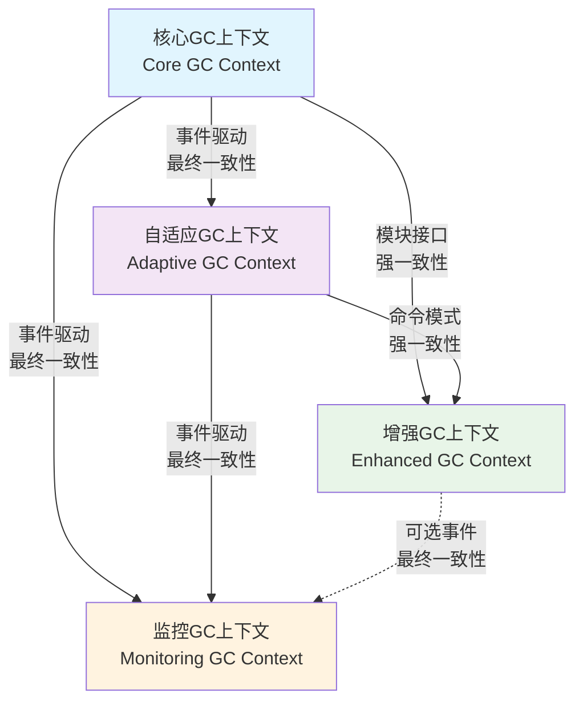

# GC上下文关系分析

## 1. 上下文关系图



## 2. 详细关系分析

### 2.1 核心GC → 自适应GC (Customer-Supplier关系)
**关系类型**：客户-供应商（Customer-Supplier）
- **客户**：核心GC上下文（需要智能决策）
- **供应商**：自适应GC上下文（提供决策服务）

**集成模式**：
- **上游发布语言**：核心GC定义性能指标和GC状态事件
- **下游客户语言**：自适应GC理解核心GC的事件和指标
- **翻译层**：无需要（共享事件格式）

**通信协议**：
```yaml
# 事件驱动通信
events:
  - GCCycleCompleted:  # 核心GC发布
      payload: 
        gcId: string
        duration: int64
        pauseTime: int64
        memoryReclaimed: int64
    subscribers: [AdaptiveGCContext]
    
  - ConfigAdjustmentRequired:  # 自适应GC发布
      payload:
        adjustments: [ConfigAdjustment]
    subscribers: [CoreGCContext]
```

**数据格式**：
```go
// 共享的数据传输对象
type PerformanceMetrics struct {
    PauseTimeP95    time.Duration
    ThroughputLoss  float64
    MemoryOverhead  float64
    AllocationRate  int64
}

type ConfigAdjustment struct {
    ParameterName   string
    OldValue        interface{}
    NewValue        interface{}
    Reason          string
}
```

**依赖方向**：
- **运行时依赖**：核心GC → 自适应GC（事件订阅）
- **编译时依赖**：自适应GC → 核心GC（接口调用）
- **部署依赖**：自适应GC可选部署

### 2.2 核心GC → 增强GC (Separate Ways → Open Host Service关系)
**关系类型**：分离方式 → 开放主机服务
- **原因**：增强GC是可选的，不应该影响核心GC
- **解决方案**：通过开放主机服务模式集成

**集成模式**：
- **开放主机服务**：核心GC提供标准模块接口
- **防腐层**：增强GC实现接口，无需了解核心GC内部
- **模块注册**：启动时动态注册模块

**通信协议**：
```yaml
# 模块接口协议
module_interface:
  lifecycle:
    - init(config): 初始化模块
    - enable(): 启用模块
    - disable(): 禁用模块
    - cleanup(): 清理模块
    
  gc_hooks:
    - before_mark(): 标记前回调
    - after_mark(): 标记后回调
    - before_sweep(): 清扫前回调
    - after_sweep(): 清扫后回调
    
  data_exchange:
    - get_stats(): 获取模块统计
    - set_config(config): 设置模块配置
```

**接口定义**：
```go
// 开放主机服务接口（由核心GC定义）
type GCModule interface {
    // 生命周期管理
    Init(config ModuleConfig) error
    Enable() error
    Disable() error
    Cleanup() error
    
    // GC周期回调
    BeforeMark() error
    AfterMark() error
    BeforeSweep() error
    AfterSweep() error
    
    // 数据交换
    GetStatistics() ModuleStats
    SetConfiguration(config ModuleConfig) error
    
    // 元信息
    Name() string
    Version() string
    Dependencies() []string
}
```

**依赖方向**：
- **运行时依赖**：核心GC → 增强GC（模块调用）
- **编译时依赖**：增强GC → 核心GC（接口实现）
- **部署依赖**：增强GC按需加载

### 2.3 核心GC → 监控GC (Published Language关系)
**关系类型**：发布语言（Published Language）
- **发布者**：核心GC上下文
- **订阅者**：监控GC上下文
- **语言**：标准GC事件格式

**集成模式**：
- **发布-订阅**：核心GC发布事件，监控GC订阅处理
- **异步通信**：事件通过总线异步传递
- **最终一致性**：允许监控延迟，不影响GC执行

**通信协议**：
```yaml
# 发布语言规范
published_events:
  gc_events:
    - GCTriggered:
        fields: [gcId, triggerReason, timestamp]
        subscribers: [MonitoringGC]
        
    - GCCycleCompleted:
        fields: [gcId, duration, statistics]
        subscribers: [MonitoringGC, AdaptiveGC]
        
    - HeapPressure:
        fields: [heapId, usageRatio, pressureLevel]
        subscribers: [MonitoringGC]
```

**事件总线设计**：
```go
// 事件总线接口
type EventBus interface {
    Publish(event DomainEvent) error
    Subscribe(eventType string, handler EventHandler) error
    Unsubscribe(eventType string, handler EventHandler) error
}

// 事件处理器
type EventHandler interface {
    Handle(event DomainEvent) error
    HandledEventTypes() []string
}

// 监控GC的事件处理器
type GCMonitoringHandler struct{}

func (h *GCMonitoringHandler) Handle(event DomainEvent) error {
    // 处理GC事件，更新监控指标
    switch e := event.(type) {
    case *GCTriggered:
        return h.handleGCTriggered(e)
    case *GCCycleCompleted:
        return h.handleGCCycleCompleted(e)
    default:
        return nil
    }
}

func (h *GCMonitoringHandler) HandledEventTypes() []string {
    return []string{"gc.triggered", "gc.cycle.completed", "heap.pressure"}
}
```

**依赖方向**：
- **运行时依赖**：核心GC → 监控GC（事件发布）
- **编译时依赖**：监控GC → 核心GC（事件类型定义）
- **部署依赖**：监控GC独立部署

### 2.4 自适应GC → 增强GC (Customer-Supplier关系)
**关系类型**：客户-供应商
- **客户**：自适应GC（需要控制模块）
- **供应商**：增强GC（提供模块服务）

**集成模式**：
- **命令模式**：自适应GC发送命令控制模块
- **同步通信**：需要立即确认执行结果
- **强一致性**：模块状态变更必须成功

**通信协议**：
```yaml
# 命令模式协议
commands:
  - EnableModule:
      parameters: [moduleId, config]
      response: Success|Failure
      
  - DisableModule:
      parameters: [moduleId]
      response: Success|Failure
      
  - AdjustModuleConfig:
      parameters: [moduleId, config]
      response: Success|Failure
```

**接口设计**：
```go
// 自适应GC定义的控制接口
type ModuleController interface {
    EnableModule(moduleId string, config ModuleConfig) error
    DisableModule(moduleId string) error
    AdjustModuleConfig(moduleId string, config ModuleConfig) error
    GetModuleStatus(moduleId string) (ModuleStatus, error)
}

// 增强GC实现控制接口
type EnhancedGCModuleController struct {
    modules map[string]GCModule
}

func (c *EnhancedGCModuleController) EnableModule(moduleId string, config ModuleConfig) error {
    module, exists := c.modules[moduleId]
    if !exists {
        return fmt.Errorf("module %s not found", moduleId)
    }
    
    if err := module.Init(config); err != nil {
        return err
    }
    
    return module.Enable()
}
```

**依赖方向**：
- **运行时依赖**：自适应GC → 增强GC（命令调用）
- **编译时依赖**：增强GC → 自适应GC（接口实现）
- **部署依赖**：增强GC依赖自适应GC存在

### 2.5 自适应GC → 监控GC (Published Language关系)
**关系类型**：发布语言
- **发布者**：自适应GC上下文
- **订阅者**：监控GC上下文

**通信协议**：
```yaml
adaptive_events:
  - WorkloadAnalyzed:
      fields: [workloadType, confidence]
  - RuleExecuted:
      fields: [ruleId, action, result]
  - ConfigAdjusted:
      fields: [parameter, oldValue, newValue]
```

## 3. 关系矩阵分析

| 关系            | 通信模式  | 一致性  | 频率 | 重要性 | 失败影响 |
| --------------- | --------- | ------- | ---- | ------ | -------- |
| 核心GC→自适应GC | 事件+接口 | 最终+强 | 中   | 高     | 影响调优 |
| 核心GC→增强GC   | 模块接口  | 强      | 低   | 中     | 影响功能 |
| 核心GC→监控GC   | 事件      | 最终    | 高   | 中     | 影响观测 |
| 自适应GC→增强GC | 命令      | 强      | 低   | 高     | 影响控制 |
| 自适应GC→监控GC | 事件      | 最终    | 中   | 低     | 影响分析 |
| 增强GC→监控GC   | 事件      | 最终    | 中   | 低     | 影响诊断 |

## 4. 集成风险评估

### 4.1 技术风险
- **事件丢失**：异步事件可能丢失，需要重试机制
- **版本不兼容**：上下文独立演化可能导致接口不匹配
- **性能开销**：跨上下文通信增加延迟

### 4.2 业务风险
- **决策延迟**：自适应决策依赖监控数据，可能有延迟
- **配置冲突**：多个上下文同时修改配置可能冲突
- **级联故障**：一个上下文故障可能影响其他上下文

### 4.3 运维风险
- **部署复杂性**：多上下文部署和配置管理复杂
- **调试困难**：跨上下文问题定位困难
- **监控盲区**：上下文间交互缺乏统一监控

## 5. 集成策略优化

### 5.1 通信优化
```go
// 批量事件处理
type EventBatchProcessor struct {
    events []DomainEvent
    batchSize int
    flushInterval time.Duration
}

func (p *EventBatchProcessor) AddEvent(event DomainEvent) {
    p.events = append(p.events, event)
    if len(p.events) >= p.batchSize {
        p.flush()
    }
}

// 异步命令处理
type AsyncCommandProcessor struct {
    commandQueue chan Command
    resultChan   chan CommandResult
    workerPool   *WorkerPool
}

func (p *AsyncCommandProcessor) ProcessCommand(cmd Command) <-chan CommandResult {
    resultChan := make(chan CommandResult, 1)
    p.commandQueue <- cmd
    
    go func() {
        defer close(resultChan)
        result := <-p.resultChan
        resultChan <- result
    }()
    
    return resultChan
}
```

### 5.2 容错设计
```go
// 断路器模式
type CircuitBreaker struct {
    failureThreshold int
    recoveryTimeout  time.Duration
    state            CircuitState
    failureCount     int
    lastFailureTime  time.Time
}

func (cb *CircuitBreaker) Call(operation func() error) error {
    if cb.state == OPEN {
        if time.Since(cb.lastFailureTime) > cb.recoveryTimeout {
            cb.state = HALF_OPEN
        } else {
            return ErrCircuitOpen
        }
    }
    
    err := operation()
    if err != nil {
        cb.recordFailure()
        return err
    } else {
        cb.recordSuccess()
        return nil
    }
}
```

### 5.3 监控集成
```go
// 上下文间调用监控
type ContextCallMonitor struct {
    callMetrics map[string]*CallMetrics
    alertThresholds AlertThresholds
}

type CallMetrics struct {
    TotalCalls      int64
    SuccessCalls    int64
    FailedCalls     int64
    AverageLatency  time.Duration
    LastCallTime    time.Time
    ErrorRate       float64
}

func (m *ContextCallMonitor) RecordCall(
    fromContext, toContext string, 
    duration time.Duration, 
    success bool, 
    error error) {
    
    key := fromContext + "->" + toContext
    metrics := m.callMetrics[key]
    
    metrics.TotalCalls++
    if success {
        metrics.SuccessCalls++
    } else {
        metrics.FailedCalls++
    }
    
    // 更新平均延迟
    metrics.AverageLatency = 
        (metrics.AverageLatency + duration) / 2
    
    // 检查告警阈值
    m.checkThresholds(key, metrics)
}
```

## 6. 演化策略

### 6.1 版本兼容性
- **事件版本控制**：事件格式向后兼容
- **接口契约管理**：接口变更需要协商
- **渐进式升级**：支持新旧版本并存

### 6.2 扩展机制
- **插件架构**：新上下文作为插件添加
- **配置驱动**：通过配置启用/禁用关系
- **服务发现**：动态发现和连接上下文

### 6.3 重构策略
- **识别重构时机**：关系过于复杂或性能瓶颈
- **渐进式重构**：逐步调整关系，保持兼容
- **测试驱动**：重构后通过集成测试验证
