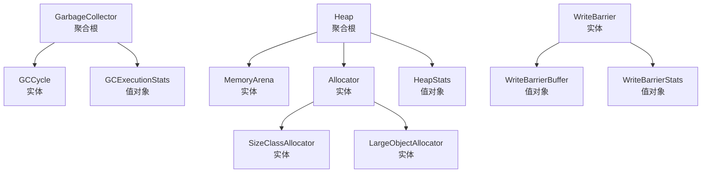

# 核心GC上下文 - 实体定义

## 1. GarbageCollector (垃圾回收器) - 聚合根

### 1.1 业务职责
- 管理GC执行的完整生命周期
- 协调标记和清扫阶段
- 维护GC状态的一致性
- 响应GC触发请求

### 1.2 身份标识
```go
type GarbageCollectorID string

// NewGarbageCollectorID 生成新的GC标识
func NewGarbageCollectorID() GarbageCollectorID {
    return GarbageCollectorID(uuid.New().String())
}
```

### 1.3 核心属性
```go
type GarbageCollector struct {
    // 身份标识
    id GarbageCollectorID
    
    // GC状态
    status GCStatus           // 当前状态
    phase  GCPhase            // 当前阶段
    
    // 配置信息
    config GCConfiguration    // GC配置
    
    // 执行统计
    stats GCExecutionStats    // 执行统计
    
    // 关联对象
    heapID HeapID            // 关联的堆
}
```

### 1.4 关键业务方法

#### 触发GC
```go
// TriggerGC 触发新的GC周期
// 前置条件：GC当前处于空闲状态
// 后置条件：GC状态变为执行中，发布GCTriggered事件
func (gc *GarbageCollector) TriggerGC(triggerReason string) error {
    if gc.status != GCStatusIdle {
        return fmt.Errorf("GC is already running")
    }
    
    // 1. 改变状态
    gc.status = GCStatusRunning
    gc.phase = GCPhaseMark
    
    // 2. 记录触发信息
    gc.stats.LastTriggeredAt = time.Now()
    gc.stats.TriggerReason = triggerReason
    
    // 3. 发布领域事件
    event := GCTriggeredEvent{
        GCID:          string(gc.id),
        TriggerReason: triggerReason,
        Timestamp:     time.Now(),
    }
    gc.eventPublisher.Publish(event)
    
    return nil
}
```

#### 完成GC周期
```go
// CompleteGCCycle 完成GC周期
// 前置条件：GC处于执行中状态
// 后置条件：GC状态变为闲置，更新统计信息，发布GCCycleCompleted事件
func (gc *GarbageCollector) CompleteGCCycle(finalStats GCExecutionStats) error {
    if gc.status != GCStatusRunning {
        return fmt.Errorf("GC is not running")
    }
    
    // 1. 改变状态
    gc.status = GCStatusIdle
    gc.phase = GCPhaseIdle
    
    // 2. 更新统计信息
    gc.stats = gc.stats.Merge(finalStats)
    gc.stats.TotalCycles++
    gc.stats.LastCompletedAt = time.Now()
    
    // 3. 发布领域事件
    event := GCCycleCompletedEvent{
        GCID:       string(gc.id),
        Statistics: gc.stats,
        Timestamp:  time.Now(),
    }
    gc.eventPublisher.Publish(event)
    
    return nil
}
```

#### 获取当前状态
```go
// GetCurrentStatus 获取当前GC状态
func (gc *GarbageCollector) GetCurrentStatus() GCStatusInfo {
    return GCStatusInfo{
        Status:     gc.status,
        Phase:      gc.phase,
        Config:     gc.config,
        Statistics: gc.stats,
    }
}
```

### 1.5 不变性条件
- **状态一致性**：status和phase必须保持同步
- **配置稳定性**：在GC周期内配置不得改变
- **统计准确性**：统计信息必须反映实际执行情况

## 2. GCCycle (GC周期) - 实体

### 2.1 业务职责
- 记录单个GC周期的执行详情
- 跟踪各个阶段的执行时间
- 维护周期内的统计信息

### 2.2 身份标识
```go
type GCCycleID string

type GCCycle struct {
    id        GCCycleID
    gcID      GarbageCollectorID  // 所属的GC
    
    // 时间信息
    startTime time.Time
    endTime   *time.Time
    
    // 阶段信息
    phases []GCPhaseRecord
    
    // 统计信息
    statistics GCCycleStats
}
```

### 2.3 关键业务方法

#### 开始新阶段
```go
func (cycle *GCCycle) StartPhase(phase GCPhase) error {
    if cycle.endTime != nil {
        return fmt.Errorf("cycle already completed")
    }
    
    // 检查阶段顺序
    if !cycle.isValidPhaseTransition(cycle.currentPhase(), phase) {
        return fmt.Errorf("invalid phase transition: %s -> %s", 
            cycle.currentPhase(), phase)
    }
    
    // 添加阶段记录
    record := GCPhaseRecord{
        Phase:      phase,
        StartTime:  time.Now(),
    }
    cycle.phases = append(cycle.phases, record)
    
    return nil
}
```

#### 完成当前阶段
```go
func (cycle *GCCycle) CompletePhase(stats PhaseStats) error {
    if len(cycle.phases) == 0 {
        return fmt.Errorf("no active phase")
    }
    
    currentIndex := len(cycle.phases) - 1
    cycle.phases[currentIndex].EndTime = time.Now()
    cycle.phases[currentIndex].Stats = stats
    
    // 更新周期统计
    cycle.updateCycleStats(stats)
    
    return nil
}
```

## 3. Heap (堆) - 聚合根

### 3.1 业务职责
- 管理应用程序的内存空间
- 协调内存分配和回收
- 维护堆的使用统计
- 响应内存压力事件

### 3.2 身份标识
```go
type HeapID string

type Heap struct {
    id     HeapID
    config HeapConfiguration
    
    // 内存区域
    arena *MemoryArena
    
    // 分配器
    allocator ObjectAllocator
    
    // 统计信息
    stats HeapStats
    
    // GC相关
    gcID GarbageCollectorID  // 关联的GC
}
```

### 3.3 关键业务方法

#### 分配对象
```go
func (h *Heap) AllocateObject(size size_t, objType ObjectType) (*Object, error) {
    // 检查分配限制
    if !h.canAllocate(size) {
        return nil, ErrOutOfMemory
    }
    
    // 执行分配
    obj, err := h.allocator.Allocate(size, objType)
    if err != nil {
        return nil, err
    }
    
    // 更新统计
    h.stats.TotalAllocated += size
    h.stats.LiveObjects++
    
    // 检查内存压力
    h.checkMemoryPressure()
    
    return obj, nil
}
```

#### 标记对象
```go
func (h *Heap) MarkObject(obj *Object) error {
    if !h.contains(obj) {
        return fmt.Errorf("object not in this heap")
    }
    
    // 设置标记位
    h.arena.SetMarkBit(obj.Address, true)
    
    // 更新统计
    h.stats.MarkedObjects++
    
    return nil
}
```

#### 清扫回收
```go
func (h *Heap) Sweep() (int64, error) {
    reclaimed := int64(0)
    
    // 遍历所有对象
    h.arena.IterateObjects(func(obj *Object) bool {
        if !h.arena.GetMarkBit(obj.Address) {
            // 未标记的对象，回收
            size := h.allocator.Deallocate(obj)
            reclaimed += int64(size)
            h.stats.LiveObjects--
        } else {
            // 已标记的对象，清除标记位，为下次GC准备
            h.arena.SetMarkBit(obj.Address, false)
        }
        return true // 继续迭代
    })
    
    // 更新统计
    h.stats.TotalReclaimed += reclaimed
    h.stats.LastSweepTime = time.Now()
    
    return reclaimed, nil
}
```

## 4. Allocator (分配器) - 实体

### 4.1 业务职责
- 执行具体的内存分配操作
- 管理不同大小类的分配器
- 维护分配统计信息

### 4.2 核心属性
```go
type Allocator struct {
    heapID HeapID
    
    // 大小类分配器
    sizeClasses [67]*SizeClassAllocator
    
    // 大对象分配器
    largeAllocator *LargeObjectAllocator
    
    // 统计信息
    stats AllocatorStats
}
```

### 4.3 关键业务方法

#### 分配内存
```go
func (a *Allocator) Allocate(size size_t, objType ObjectType) (*Object, error) {
    if size > LargeObjectThreshold {
        // 大对象分配
        return a.largeAllocator.Allocate(size, objType)
    }
    
    // 小对象分配
    sizeClass := a.getSizeClass(size)
    return a.sizeClasses[sizeClass].Allocate(objType)
}
```

#### 回收内存
```go
func (a *Allocator) Deallocate(obj *Object) size_t {
    size := obj.Size
    
    if size > LargeObjectThreshold {
        a.largeAllocator.Deallocate(obj)
    } else {
        sizeClass := a.getSizeClass(size)
        a.sizeClasses[sizeClass].Deallocate(obj)
    }
    
    return size
}
```

## 5. WriteBarrier (写屏障) - 实体

### 5.1 业务职责
- 维护GC的三色不变性
- 记录对象间的引用关系变化
- 支持并发GC的安全性

### 5.2 核心属性
```go
type WriteBarrier struct {
    heap *Heap
    
    // 屏障配置
    mode WriteBarrierMode  // Dijkstra, Yuasa, Hybrid
    
    // 缓冲区（批量处理）
    buffer WriteBarrierBuffer
    
    // 统计信息
    stats WriteBarrierStats
}
```

### 5.3 关键业务方法

#### 执行写屏障
```go
func (wb *WriteBarrier) Execute(slot *uintptr, newValue uintptr) {
    oldValue := *slot
    
    // 批量缓冲处理
    wb.buffer.AddEntry(slot, oldValue, newValue)
    
    // 检查是否需要立即处理
    if wb.buffer.IsFull() {
        wb.processBuffer()
    }
    
    // 执行实际写入
    *slot = newValue
}
```

#### 处理缓冲区
```go
func (wb *WriteBarrier) ProcessBuffer() {
    for _, entry := range wb.buffer.Entries {
        wb.processWriteBarrierEntry(entry)
    }
    wb.buffer.Clear()
}
```

#### 处理单个屏障条目
```go
func (wb *WriteBarrier) processWriteBarrierEntry(entry WriteBarrierEntry) {
    switch wb.mode {
    case WriteBarrierModeDijkstra:
        // Dijkstra插入屏障：标记新引用
        if entry.NewValue != 0 && wb.heap.IsWhite(entry.NewValue) {
            wb.heap.MarkGray(entry.NewValue)
        }
        
    case WriteBarrierModeYuasa:
        // Yuasa删除屏障：标记旧引用
        if entry.OldValue != 0 && wb.heap.IsWhite(entry.OldValue) {
            wb.heap.MarkGray(entry.OldValue)
        }
        
    case WriteBarrierModeHybrid:
        // 混合屏障：结合两者
        if entry.NewValue != 0 && wb.heap.IsWhite(entry.NewValue) {
            wb.heap.MarkGray(entry.NewValue)
        }
        if entry.OldValue != 0 && wb.heap.IsWhite(entry.OldValue) {
            wb.heap.MarkGray(entry.OldValue)
        }
    }
    
    wb.stats.ProcessedEntries++
}
```

## 6. 实体关系图



## 7. 实体生命周期

### 7.1 GarbageCollector生命周期
```
创建 → 闲置 → 触发 → 执行中 → 完成 → 闲置 → ...
```

### 7.2 Heap生命周期
```
初始化 → 分配中 → GC中 → 分配中 → ...
```

### 7.3 GCCycle生命周期
```
创建 → 标记阶段 → 清扫阶段 → 完成
```

## 8. 实体不变性

### 8.1 垃圾回收器不变性
- ID一旦创建不可改变
- 状态转换必须遵循正确的顺序
- 配置在GC周期内保持不变

### 8.2 堆不变性
- 堆ID唯一标识堆实例
- 分配和回收操作必须保持内存一致性
- 统计信息必须反映实际状态

### 8.3 分配器不变性
- 分配器与特定堆绑定
- 分配操作必须保证内存安全性
- 大小类配置一旦设置不可改变
