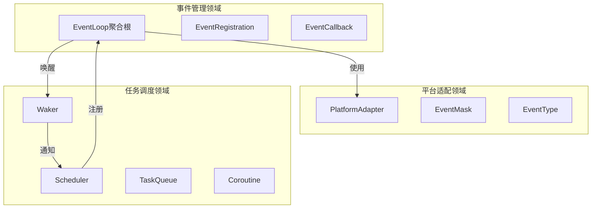

# 事件循环领域DDD设计文档

## 概述

**核心设计原则**：
1. **跨平台抽象**：统一接口屏蔽epoll/kqueue/IOCP差异
2. **事件驱动**：被动等待I/O事件，主动唤醒任务
3. **解耦架构**：事件循环不依赖调度器，通过Waker接口通信
4. **生命周期管理**：事件注册与任务生命周期严格绑定

**整体流程图**：
```
外部事件源 → 操作系统I/O机制 → 事件循环 → Waker → 调度器 → 任务执行
     ↓              ↓              ↓         ↓        ↓        ↓
   网络数据      epoll/kqueue    收集事件  唤醒任务  放就绪队列 执行任务
   定时器        IOCP           分发回调   解耦设计  上下文切换 恢复执行
   通道消息      异步I/O        平台抽象   接口隔离  状态管理   继续await
```

---

## 我的思考过程：7步分析事件循环领域

### 第一步：扫描并提取所有动词和名词（5分钟）

从事件循环领域中提取：

**名词**（实体/值对象候选）：
- EventLoop, FileDescriptor, EventType, EventCallback, Platform, Timeout, Wakeup
- Task, Waker, ReadyQueue, Scheduler, Context, Stack, Coroutine
- PollResult, EventRegistration, EventState, EventMask

**动词**（领域服务/行为候选）：
- Create, Destroy, AddEvent, RemoveEvent, ModifyEvent, Poll, Wakeup
- RegisterCallback, UnregisterCallback, HandleEvent, DispatchEvent
- SwitchContext, SaveStack, RestoreStack, Yield, Resume
- ScheduleTask, WakeTask, BlockTask, UnblockTask

---

### 第二步：聚类成候选领域（10分钟）

**第一轮聚类**：

1. **事件管理领域**：
   - EventLoop, FileDescriptor, EventType, EventCallback, PollResult, EventRegistration
   - Create, Destroy, AddEvent, RemoveEvent, ModifyEvent, Poll, HandleEvent

2. **平台适配领域**：
   - Platform, EventState, EventMask, Timeout, Wakeup
   - 负责屏蔽epoll/kqueue/IOCP差异

3. **任务调度领域**：
   - Task, Waker, ReadyQueue, Scheduler, Context, Stack, Coroutine
   - SwitchContext, ScheduleTask, WakeTask, Yield, Resume

---

### 第三步：识别领域边界和关系（15分钟）



**关键关系**：
- 事件管理领域 → 平台适配领域（依赖抽象接口）
- 任务调度领域 → 事件管理领域（注册事件，接收唤醒）
- 事件管理领域 → 任务调度领域（通过Waker解耦）

---

### 第四步：识别聚合根和实体（20分钟）

根据名词和动词关系，识别聚合根：

1. **EventLoop（事件循环聚合根）**
   - 包含：EventRegistration[], PlatformAdapter
   - 职责：管理事件注册，协调平台适配，执行事件轮询
   - 生命周期：Create → Add/Remove/Modify Events → Poll → Destroy

2. **Scheduler（调度器聚合根）**
   - 包含：Task[], ReadyQueue, Waker[]
   - 职责：管理任务生命周期，执行上下文切换，协调事件循环
   - 生命周期：Init → Schedule Tasks → Run Loop → Shutdown

3. **Task（任务聚合根）**
   - 包含：Coroutine, Future, Stack
   - 职责：维护任务执行状态，管理协程上下文
   - 生命周期：Create → Execute → Block/Unblock → Complete

---

### 第五步：提取值对象和领域服务（15分钟）

**值对象**（不可变，无标识）：
1. **EventType**：事件类型（READ/WRITE/ERROR/TIMER）
2. **EventMask**：事件掩码（位标志组合）
3. **FileDescriptor**：文件描述符封装
4. **Timeout**：超时时间值对象
5. **WakerToken**：唤醒令牌（轻量级标识）

**领域服务**（协调多个实体）：
1. **EventDispatcher**：事件分发服务，协调EventLoop和PlatformAdapter
2. **PlatformDetector**：平台检测服务，确定运行平台类型
3. **WakerFactory**：唤醒器工厂，为Task创建Waker实例
4. **ContextSwitcher**：上下文切换服务，管理协程栈操作

---

### 第六步：确定分层架构（10分钟）

**应用层**：
```
├── EventLoopManager (统一管理接口)
└── SchedulerCoordinator (调度协调器)
```

**领域层**：
```
├── eventloop/
│   ├── event_loop.go        # EventLoop聚合根
│   ├── event_registration.go # EventRegistration实体
│   ├── services/            # 领域服务
│   │   ├── event_dispatcher.go
│   │   └── platform_detector.go
│   └── valueobjects/        # 值对象
│       ├── event_type.go
│       └── event_mask.go
├── scheduler/
│   ├── scheduler.go         # Scheduler聚合根
│   ├── task.go             # Task聚合根
│   ├── waker.go            # Waker值对象
│   ├── services/
│   │   ├── waker_factory.go
│   │   └── context_switcher.go
│   └── valueobjects/
│       └── timeout.go
└── shared/
    └── interfaces/          # 跨领域接口
        ├── waker.go        # Waker接口定义
        └── event_callback.go
```

**基础设施层**：
```
├── platform/                # 平台特定实现
│   ├── linux/
│   │   └── epoll_adapter.go
│   ├── macos/
│   │   └── kqueue_adapter.go
│   └── windows/
│       └── iocp_adapter.go
├── context/                 # 上下文切换
│   ├── x86_64/
│   │   ├── context_switch.S
│   │   └── context.h
│   └── aarch64/
│       └── context_switch.S
└── system/                  # 系统调用封装
    ├── file_descriptor.go
    └── timer.go
```

---

### 第七步：编写领域对象草图（15分钟）

```go
// 1. EventLoop 聚合根草图
type EventLoop struct {
    id          string
    platform    PlatformAdapter
    registrations map[int]*EventRegistration  // fd -> registration
    running     bool
    wakeupFd    int  // 用于跨线程唤醒
}

func (el *EventLoop) AddEvent(fd int, events EventMask, callback EventCallback) error
func (el *EventLoop) RemoveEvent(fd int) error
func (el *EventLoop) Poll(timeout Timeout) ([]EventResult, error)
func (el *EventLoop) Wakeup() error  // 跨线程唤醒

// 2. EventRegistration 实体草图
type EventRegistration struct {
    fd          int
    events      EventMask
    callback    EventCallback
    userData    interface{}
    active      bool
}

// 3. EventType 值对象草图
type EventType struct {
    value int
}

const (
    EVENT_READ  = EventType{1}
    EVENT_WRITE = EventType{2}
    EVENT_ERROR = EventType{4}
    EVENT_TIMER = EventType{8}
)

func (et EventType) IsRead() bool { return et.value&1 != 0 }

// 4. Waker 值对象草图
type Waker struct {
    taskId      string
    scheduler   *Scheduler  // 通过接口引用避免循环依赖
}

func (w *Waker) Wake() error {
    return w.scheduler.WakeTask(w.taskId)
}

// 5. Task 聚合根草图
type Task struct {
    id          string
    coroutine   *Coroutine
    future      *Future
    status      TaskStatus
    waker       *Waker
}

func (t *Task) Execute() error
func (t *Task) Suspend() error
func (t *Task) Resume() error
func (t *Task) SetFuture(future *Future)

// 6. Scheduler 聚合根草图
type Scheduler struct {
    id          string
    tasks       map[string]*Task
    readyQueue  *TaskQueue
    eventLoop   EventLoopInterface  // 接口依赖
    processors  []*Processor
}

func (s *Scheduler) ScheduleTask(task *Task) error
func (s *Scheduler) Run() error
func (s *Scheduler) WakeTask(taskId string) error
```

---

## 完整的设计生成流程

### 阶段一：原始流程分析（30分钟）

#### 第1步：标记流程中的技术决策点

在事件循环流程中，技术决策点：

- [ ] 上下文切换实现方式（ucontext/setjmp/汇编）
- [ ] 事件模型选择（epoll/kqueue/IOCP）
- [ ] 任务窃取算法（work-stealing）
- [ ] 定时器管理策略（wheel/hash）

#### 第2步：区分核心逻辑和实现细节

**核心业务逻辑**（必须建模）：
1. 事件注册和取消
2. 事件轮询和分发
3. 任务唤醒机制
4. 跨平台抽象

**实现细节**（可以推迟）：
1. 具体的事件API调用
2. 汇编级别的上下文切换
3. 平台特定的系统调用
4. 内存分配策略

### 阶段二：领域设计细化（45分钟）

#### 第3步：定义每个领域的职责边界

**事件管理领域 (EventLoop)**

职责：
- 提供统一的事件注册接口
- 管理事件生命周期
- 执行事件轮询
- 分发事件到回调函数

边界：
- 不关心事件的具体含义
- 不直接操作任务调度
- 不实现平台特定的API

**平台适配领域 (Platform)**

职责：
- 检测运行平台
- 提供平台特定的I/O机制
- 封装系统调用差异
- 处理平台相关的错误

边界：
- 只提供抽象接口
- 不包含业务逻辑
- 不管理事件状态

**任务调度领域 (Scheduler)**

职责：
- 管理任务生命周期
- 执行上下文切换
- 协调事件循环
- 实现任务窃取

边界：
- 不直接操作I/O
- 不关心平台差异
- 通过Waker与事件循环解耦

#### 第4步：设计领域事件流

**事件流**：
1. TaskSuspend (任务挂起)
2. EventRegistered (事件注册)
3. EventOccurred (事件发生)
4. TaskWoken (任务唤醒)
5. TaskResumed (任务恢复)
6. EventUnregistered (事件取消)

#### 第5步：设计关键接口契约

```go
// 1. 事件循环接口（领域服务契约）
type EventLoopService interface {
    RegisterEvent(fd int, events EventMask, callback EventCallback) (EventToken, error)
    UnregisterEvent(token EventToken) error
    PollEvents(timeout Timeout) ([]EventNotification, error)
}

// 2. 平台适配器接口（基础设施契约）
type PlatformAdapter interface {
    CreateEventHandle() (EventHandle, error)
    RegisterEvent(handle EventHandle, fd int, events EventMask) error
    UnregisterEvent(handle EventHandle, fd int) error
    PollEvents(handle EventHandle, timeout Timeout) ([]PlatformEvent, error)
}

// 3. 调度器接口（领域服务契约）
type SchedulerService interface {
    ScheduleTask(task TaskDescriptor) (TaskHandle, error)
    WakeTask(handle TaskHandle) error
    CreateWaker(taskHandle TaskHandle) Waker
}

// 4. Waker接口（解耦契约）
type Waker interface {
    Wake() error  // 统一的唤醒接口
}
```

### 阶段三：目录结构生成（15分钟）

#### 第6步：基于分析生成目录

```
internal/modules/eventloop/
├── application/                    # 应用层
│   ├── event_loop_manager.go       # 统一管理接口
│   ├── scheduler_coordinator.go    # 调度协调器
│   ├── commands/                   # 命令模式
│   │   ├── register_event_command.go
│   │   └── schedule_task_command.go
│   └── dtos/                       # 数据传输对象
│       ├── event_registration_dto.go
│       └── task_descriptor_dto.go
│
├── domain/                         # 领域层
│   ├── eventloop/                  # 事件管理领域
│   │   ├── event_loop.go           # EventLoop聚合根
│   │   ├── event_registration.go   # EventRegistration实体
│   │   ├── event_callback.go       # EventCallback值对象
│   │   ├── services/               # 领域服务
│   │   │   ├── event_dispatcher.go
│   │   │   └── platform_detector.go
│   │   ├── events/                 # 领域事件
│   │   │   ├── event_registered.go
│   │   │   └── event_occurred.go
│   │   ├── repositories/           # 仓储接口
│   │   │   └── event_repository.go
│   │   └── valueobjects/           # 值对象
│   │       ├── event_type.go
│   │       └── event_mask.go
│   │
│   ├── scheduler/                  # 任务调度领域
│   │   ├── scheduler.go            # Scheduler聚合根
│   │   ├── task.go                 # Task聚合根
│   │   ├── waker.go                # Waker值对象
│   │   ├── services/
│   │   │   ├── waker_factory.go
│   │   │   └── context_switcher.go
│   │   ├── events/
│   │   │   ├── task_scheduled.go
│   │   │   └── task_woken.go
│   │   ├── repositories/
│   │   │   └── task_repository.go
│   │   └── valueobjects/
│   │       ├── task_status.go
│   │       └── timeout.go
│   │
│   └── shared/                     # 跨领域共享
│       └── interfaces/             # 统一接口定义
│           ├── waker.go           # Waker接口
│           ├── event_callback.go  # 事件回调接口
│           └── platform_adapter.go # 平台适配器接口
│
└── infrastructure/                # 基础设施层
    ├── platform/                  # 平台特定实现
    │   ├── linux/
    │   │   ├── epoll_adapter.go
    │   │   └── epoll_adapter_test.go
    │   ├── macos/
    │   │   ├── kqueue_adapter.go
    │   │   └── kqueue_adapter_test.go
    │   └── windows/
    │       ├── iocp_adapter.go
    │       └── iocp_adapter_test.go
    │
    ├── context/                   # 上下文切换
    │   ├── x86_64/
    │   │   ├── context_switch.S   # 汇编实现
    │   │   └── context_switch.h
    │   └── aarch64/
    │       └── context_switch.S
    │
    ├── system/                    # 系统调用封装
    │   ├── file_descriptor.go
    │   ├── timer.go
    │   └── signal_handler.go
    │
    ├── persistence/               # 持久化（如果需要）
    │   ├── event_store.go
    │   └── task_store.go
    │
    └── messaging/                 # 消息通信
        ├── event_bus.go
        └── event_publisher.go
```

---

### 阶段四：实现优先级排序（10分钟）

#### 第7步：确定MVP实现顺序

**第1批：核心事件循环（2-3天）**
1. EventLoop聚合根 + 基础接口
2. PlatformDetector + 平台抽象
3. 简单的单线程事件轮询

目标：能注册事件，执行基本轮询

**第2批：任务调度集成（2-3天）**
1. Scheduler聚合根 + Task聚合根
2. Waker机制 + 事件唤醒
3. 基本的上下文切换

目标：任务能被事件唤醒，基本调度功能

**第3批：跨平台支持（3-4天）**
1. Linux epoll适配器
2. macOS kqueue适配器
3. Windows IOCP适配器

目标：核心平台支持，统一接口

**第4批：高级功能（持续优化）**
1. 工作窃取调度器
2. 定时器管理
3. 信号处理
4. 性能优化

### 阶段五：验证和调整（10分钟）

#### 第8步：用原始需求验证设计

回验事件循环的核心需求：

| 需求          | 对应领域设计               | 验证结果 |
| ------------- | -------------------------- | -------- |
| 跨平台抽象    | PlatformAdapter + 统一接口 | ✅ 满足   |
| 事件注册/取消 | EventLoop.Add/RemoveEvent  | ✅ 满足   |
| 阻塞轮询      | EventLoop.Poll(timeout)    | ✅ 满足   |
| 回调机制      | EventCallback函数指针      | ✅ 满足   |
| 跨线程唤醒    | EventLoop.Wakeup()         | ✅ 满足   |
| 与调度器集成  | Waker接口解耦              | ✅ 满足   |
| 上下文切换    | ContextSwitcher领域服务    | ✅ 满足   |
| 协程支持      | Task.Coroutine + 栈管理    | ✅ 满足   |

---

## 总结：事件循环领域的7步分析法

1. **词性分析**：提取名词和动词，建立领域词汇表
2. **概念聚类**：按职责相似性分组，形成候选领域
3. **边界识别**：绘制领域关系图，明确依赖方向
4. **聚合识别**：找到核心业务实体和生命周期管理器
5. **服务提取**：识别跨实体协调逻辑和不变业务规则
6. **分层设计**：建立应用/领域/基础设施的清晰边界
7. **对象草图**：编写核心类的伪代码，验证设计完整性

### 方法论的关键

这个方法论的关键是从具体的技术需求（epoll/kqueue/IOCP）到抽象的领域模型（EventLoop聚合根），再回到具体的实现。通过分层抽象，我们获得了：

1. **跨平台兼容性**：统一接口屏蔽系统差异
2. **架构清晰性**：领域职责明确，边界清晰
3. **可扩展性**：新平台支持只需实现适配器
4. **可测试性**：领域逻辑独立测试，基础设施可Mock
5. **可维护性**：技术细节与业务逻辑分离

### 实施建议

**开始顺序**：
1. 先实现领域层接口和核心聚合根
2. 再实现基础设施层的平台适配器
3. 最后集成应用层的使用场景

**测试策略**：
- 领域层：纯逻辑测试，无外部依赖
- 基础设施层：针对每个平台的集成测试
- 应用层：端到端的功能测试

**团队协作**：
- 领域专家负责业务边界定义
- 平台专家负责适配器实现
- 测试专家负责跨平台验证

通过这个DDD设计，事件循环不再是简单的技术组件，而是具备清晰职责、明确边界、可扩展架构的领域模型。
