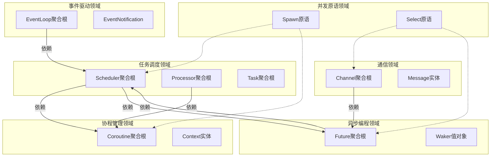

# Echo Runtime 并发架构 DDD 设计文档

## 概述

**核心设计原则**：
1. **四大支柱架构**：Waker/Future/Task/EventLoop 构成异步运行时的核心组件
2. **Reactor模式**：EventLoop作为Reactor，监听I/O事件并通过Waker唤醒任务
3. **Executor执行器**：单线程执行器，包含Scheduler和Task池，驱动任务执行
4. **Runtime闭环**：Runtime → Executor → Future → Reactor → Waker → Executor 的完整异步循环
5. **GMP扩展性**：在闭环基础上扩展为Goroutine-Machine-Processor多核并发模型
6. **协程用户空间调度**：轻量级上下文切换，无需内核干预
7. **通道通信原语**：类型安全、阻塞/非阻塞操作，支持select多路复用

**整体流程图**：
```
用户代码 → spawn/async → Task 创建 → Executor 分发 → 协程执行 → Future 等待
    ↓         ↓         ↓         ↓          ↓          ↓
编译器    Future    单线程模型  就绪队列    上下文切换   await/yield
生成      异步结果   Reactor集成   任务池    栈保存      Waker注册

完整闭环：Runtime启动 → Executor驱动 → Future Pending → Waker注册Reactor
                 ↓              ↓              ↓              ↓
              事件监听       任务执行       I/O等待        事件触发
                 ↓              ↓              ↓              ↓
              Reactor就绪   协程切换       阻塞挂起        Waker唤醒
```

---

## 我的思考过程：7步分析 runtime 并发架构

### 第一步：扫描并提取所有动词和名词（5分钟）

从 runtime 并发架构中提取：

**名词**（实体/值对象候选）：
- Task, Future, Coroutine, Scheduler, Processor, Machine, Channel, Message
- GMP, Context, Stack, Queue, ReadyQueue, GlobalQueue, LocalQueue
- Waker, EventLoop, AsyncFunction, SpawnExpr, SelectExpr, ChanType
- TaskStatus, FutureState, CoroutineState, ChannelState
- EventNotification, EventMask, Timeout, WorkStealing

**动词**（领域服务/行为候选）：
- Schedule, Execute, SwitchContext, Suspend, Resume, Wake, Poll, Await
- Send, Receive, Create, Destroy, Enqueue, Dequeue, Spawn, Select
- Yield, Switch, Balance, StealWork, Resolve, Reject, Cancel
- RegisterEvent, UnregisterEvent, PollEvents, Wakeup

---

### 第二步：聚类成候选领域（10分钟）

**第一轮聚类**：

1. **执行器领域**：
   - Executor, Scheduler, Task, TaskPool, ReadyQueue, Execute, Schedule
   - 负责任务的创建、分发、执行生命周期管理（单线程版本）

2. **反应器领域**：
   - Reactor, EventLoop, EventRegistration, EventNotification, Poll, Wakeup
   - 负责I/O事件监听、分发，通过Waker唤醒任务

3. **异步编程领域**：
   - Future, Waker, AsyncFunction, Await, Resolve, Reject, Cancel
   - 负责异步计算的结果管理、唤醒机制、取消处理

4. **协程管理领域**：
   - Coroutine, Context, Stack, SwitchContext, Suspend, Resume, Yield
   - 负责协程的创建、上下文切换、栈管理

5. **通信领域**：
   - Channel, Message, Send, Receive, Select, ChanType
   - 负责类型安全的通道通信、多路选择

6. **并发原语领域**：
   - Spawn, SelectExpr, WorkStealing, Balance
   - 负责并发编程的高层原语，支持GMP模型扩展

---

### 第三步：识别领域边界和关系（15分钟）



**关键关系**：
- 任务调度领域 → 协程管理领域（执行任务需要上下文切换）
- 任务调度领域 ↔ 异步编程领域（Future 唤醒 Task，Task 等待 Future）
- 通信领域 → 异步编程领域（通道操作返回 Future）
- 事件驱动领域 → 任务调度领域（I/O 事件唤醒任务）
- 并发原语领域 → 所有领域（spawn/select 协调各种并发操作）

---

### 第四步：识别聚合根和实体（20分钟）

根据名词和动词关系，识别聚合根：

1. **Executor（执行器聚合根）**
   - 包含：Scheduler, TaskPool, ReadyQueue, Reactor
   - 职责：任务执行驱动、调度协调、反应器集成
   - 生命周期：Init → RunLoop → ExecuteTask → HandleFuture → Shutdown

2. **Reactor（反应器聚合根）**
   - 包含：EventLoop, EventRegistration[], PlatformAdapter
   - 职责：I/O事件监听、分发，通过Waker唤醒任务
   - 生命周期：Create → RegisterEvent → Poll → Dispatch → Destroy

3. **Task（任务聚合根）**
   - 包含：Coroutine, Future, Waker
   - 职责：任务执行状态管理、协程生命周期、异步等待
   - 生命周期：Create → Execute → Await/Suspend → Complete

3. **Future（异步计算聚合根）**
   - 包含：Waker, Result, State
   - 职责：异步结果管理、唤醒通知、取消处理
   - 生命周期：Pending → Resolved/Rejected → Consumed

4. **Future（异步计算聚合根）**
   - 包含：Waker, Result, State, WaitQueue
   - 职责：异步结果管理、唤醒通知、取消处理
   - 生命周期：Pending → Resolved/Rejected → Consumed

5. **Channel（通道聚合根）**
   - 包含：Message[], SenderQueue, ReceiverQueue
   - 职责：类型安全通信、阻塞/非阻塞操作、缓冲管理
   - 生命周期：Create → Send/Receive → Close

6. **Coroutine（协程聚合根）**
   - 包含：Context, Stack, State
   - 职责：上下文切换、栈管理、协程状态转换
   - 生命周期：Create → Switch → Suspend/Resume → Destroy

---

### 第五步：提取值对象和领域服务（15分钟）

**值对象**（不可变，无标识）：
1. **TaskStatus**：任务状态枚举（READY, RUNNING, WAITING, COMPLETED, FAILED, CANCELLED）
2. **FutureState**：异步状态枚举（PENDING, RESOLVED, REJECTED）
3. **CoroutineState**：协程状态枚举（READY, RUNNING, SUSPENDED, COMPLETED, FAILED）
4. **EventMask**：事件掩码（READ, WRITE, ERROR, TIMER, SIGNAL）
5. **Timeout**：超时时间值对象
6. **ChannelType**：通道类型（buffered/unbuffered）
7. **WakerToken**：唤醒令牌（轻量级任务引用）

**领域服务**（协调多个实体）：
1. **TaskExecutor**：任务执行服务，驱动Executor的运行循环
2. **EventReactor**：事件反应服务，管理Reactor的事件监听和分发
3. **WakerFactory**：Waker 工厂服务，为 Task 创建 Waker 实例
4. **FutureResolver**：Future 解决服务，处理异步结果和唤醒
5. **ContextSwitcher**：上下文切换服务，管理协程栈操作
6. **ChannelManager**：通道管理服务，处理通道通信逻辑
7. **RuntimeAssembler**：运行时组装服务，集成Executor和Reactor

---

### 第六步：确定分层架构（10分钟）

**应用层**（使用领域服务）：
```
runtime/src/core/
├── runtime.c          # 运行时入口，组装Executor和Reactor
├── task.c            # 任务管理入口
├── future.c          # Future异步编程入口
├── channel.c         # 通道通信入口
├── coroutine.c       # 协程管理入口
└── event_loop.c      # 事件循环集成入口
```

**领域层**（核心业务逻辑）：
```
runtime/src/core/
├── executor/              # 执行器领域
│   ├── executor.c          # Executor聚合根实现
│   ├── scheduler.c         # 简单Scheduler实现
│   ├── task_pool.c         # Task池管理
│   ├── ready_queue.c       # 就绪队列实现
│   └── task_executor.c     # 任务执行领域服务
│
├── reactor/               # 反应器领域
│   ├── reactor.c           # Reactor聚合根实现
│   ├── event_loop.c        # EventLoop集成
│   ├── waker_dispatcher.c  # Waker分发领域服务
│   ├── event_handler.c     # 事件处理逻辑
│   └── timer_future.c      # TimerFuture示例实现
│
├── scheduler/             # GMP调度领域（扩展用）
│   ├── scheduler.c         # GMP Scheduler聚合根实现
│   ├── processor.c         # Processor聚合根实现
│   ├── machine.c          # Machine聚合根实现
│   ├── work_stealing.c    # 工作窃取领域服务
│   └── queue.c            # 队列管理
├── task/
│   ├── task.c             # Task聚合根实现
│   ├── lifecycle.c        # 任务生命周期管理
│   └── state_machine.c    # 任务状态机
├── future/
│   ├── future.c           # Future聚合根实现
│   ├── waker.c            # Waker值对象和工厂
│   ├── resolver.c         # Future解决服务
│   └── cancellation.c     # 取消机制
├── coroutine/
│   ├── coroutine.c        # Coroutine聚合根实现
│   ├── context.c          # Context实体实现
│   ├── stack.c            # 栈管理
│   └── switcher.c         # 上下文切换服务
├── channel/
│   ├── channel.c          # Channel聚合根实现
│   ├── message.c          # Message实体实现
│   ├── buffer.c           # 缓冲区管理
│   └── manager.c          # 通道管理服务
└── event/
    ├── event_loop.c       # EventLoop聚合根实现
    ├── dispatcher.c       # 事件分发服务
    ├── notification.c     # 事件通知处理
    └── integration.c      # 与调度器集成
```

**基础设施层**（平台特定实现）：
```
runtime/src/platform/
├── context/               # 上下文切换实现
│   ├── x86_64/
│   │   ├── context_switch.S
│   │   └── context.S
│   └── aarch64/
│       └── context_switch.S
├── event/                 # 事件循环平台实现
│   ├── posix/
│   │   ├── linux/epoll.c
│   │   └── macos/kqueue.c
│   └── windows/iocp.c
├── sync/                  # 同步原语
│   ├── mutex.c
│   ├── cond.c
│   └── atomic.c
└── memory/                # 内存管理
    ├── allocator.c
    └── gc.c
```

---

### 第七步：编写领域对象草图（15分钟）

```c
// 1. Executor 执行器聚合根草图
typedef struct Executor {
    uint64_t id;
    Scheduler* scheduler;        // 简单调度器
    TaskPool* task_pool;         // 任务池
    Reactor* reactor;            // 反应器
    bool running;                // 运行状态

    // 聚合根行为
    void (*run_loop)(struct Executor*);                  // 运行执行循环
    void (*spawn_task)(struct Executor*, Task*);         // 生成新任务
    void (*handle_future)(struct Executor*, Future*);    // 处理Future
    void (*shutdown)(struct Executor*);                  // 关闭执行器
} Executor;

// 2. Reactor 反应器聚合根草图
typedef struct Reactor {
    uint64_t id;
    EventLoop* event_loop;       // 事件循环
    WakerDispatcher* dispatcher; // Waker分发器
    EventHandler* handler;       // 事件处理器

    // 聚合根行为
    void (*register_future)(struct Reactor*, Future*, Waker*); // 注册Future
    void (*unregister_future)(struct Reactor*, Future*); // 取消注册
    int (*poll_events)(struct Reactor*, Timeout*);       // 轮询事件
    void (*wakeup)(struct Reactor*);                     // 唤醒
} Reactor;

// 2. Task 聚合根草图
typedef struct Task {
    uint64_t id;
    TaskStatus status;
    Coroutine* coroutine;        // 关联协程
    Future* future;              // 当前等待的异步计算
    Waker* waker;                // 唤醒器
    void* result;                // 执行结果

    // 聚合根行为
    void (*execute)(struct Task*);                    // 执行任务
    void (*suspend)(struct Task*);                    // 挂起任务
    void (*resume)(struct Task*);                     // 恢复任务
    void (*set_future)(struct Task*, Future*);        // 设置等待Future
} Task;

// 3. Future 聚合根草图
typedef struct Future {
    uint64_t id;
    FutureState state;
    void* result;                // 结果或错误
    bool consumed;               // 是否已被消费
    WaitQueue* waiters;          // 等待队列
    Waker* waker;                // 关联的唤醒器

    // 聚合根行为
    PollResult (*poll)(struct Future*, Task*);        // 轮询状态
    void (*resolve)(struct Future*, void*);           // 解决Future
    void (*reject)(struct Future*, void*);            // 拒绝Future
    void (*cancel)(struct Future*);                   // 取消Future
} Future;

// 4. Channel 聚合根草图
typedef struct Channel {
    uint64_t id;
    ChannelType type;
    void** buffer;               // 缓冲区
    size_t capacity;             // 容量
    size_t size;                 // 当前大小
    TaskQueue* senders;          // 发送者队列
    TaskQueue* receivers;        // 接收者队列

    // 聚合根行为
    bool (*send)(struct Channel*, void*, bool);       // 发送（阻塞/非阻塞）
    void* (*receive)(struct Channel*, bool);          // 接收（阻塞/非阻塞）
    bool (*is_empty)(struct Channel*);                // 检查是否为空
    bool (*is_full)(struct Channel*);                 // 检查是否已满
} Channel;

// 5. Coroutine 聚合根草图
typedef struct Coroutine {
    uint64_t id;
    CoroutineState state;
    coro_context_t context;      // 上下文（基础设施层）
    char* stack;                 // 栈内存
    size_t stack_size;
    void (*entry_point)(void*);  // 入口函数
    void* arg;                   // 函数参数

    // 聚合根行为
    void (*resume)(struct Coroutine*);                // 恢复执行
    void (*suspend)(struct Coroutine*);               // 挂起执行
    bool (*is_complete)(struct Coroutine*);           // 检查是否完成
} Coroutine;

// 6. EventLoop 聚合根草图
typedef struct EventLoop {
    uint64_t id;
    PlatformAdapter* adapter;    // 平台适配器
    EventRegistration** registrations; // 事件注册表
    size_t reg_count;
    int wakeup_fd;               // 跨线程唤醒描述符

    // 聚合根行为
    bool (*add_event)(struct EventLoop*, int, EventMask, EventCallback, void*); // 添加事件
    bool (*remove_event)(struct EventLoop*, int);       // 移除事件
    int (*poll_events)(struct EventLoop*, Timeout*, EventNotification*, int); // 轮询事件
    bool (*wakeup)(struct EventLoop*);                  // 唤醒
} EventLoop;

// 7. Waker 值对象草图
typedef struct Waker {
    uint64_t task_id;            // 任务ID（轻量级引用）
    Scheduler* scheduler;        // 调度器引用

    // 值对象行为（不可变）
    void (*wake)(const struct Waker*);                 // 唤醒任务
    void (*drop)(const struct Waker*);                 // 释放资源
} Waker;

// 8. 领域服务接口草图

// 任务调度服务
typedef struct TaskSchedulerService {
    void (*schedule)(Task*);                            // 调度任务
    void (*steal_work)(Processor*, Processor*);         // 工作窃取
    void (*balance_load)(Scheduler*);                   // 负载均衡
} TaskSchedulerService;

// 上下文切换服务
typedef struct ContextSwitcherService {
    void (*switch_to)(Coroutine*, Coroutine*);          // 切换上下文
    void (*save_stack)(Coroutine*);                     // 保存栈
    void (*restore_stack)(Coroutine*);                  // 恢复栈
} ContextSwitcherService;

// Waker工厂服务
typedef struct WakerFactoryService {
    Waker* (*create_for_task)(Task*, Scheduler*);       // 为任务创建Waker
    void (*destroy_waker)(Waker*);                      // 销毁Waker
} WakerFactoryService;

// Future解决服务
typedef struct FutureResolverService {
    void (*resolve_async)(Future*, void*);              // 异步解决
    void (*handle_cancellation)(Future*);               // 处理取消
    void (*cleanup_waiters)(Future*);                   // 清理等待者
} FutureResolverService;
```

---

## 完整的设计生成流程

### 阶段一：原始流程分析（30分钟）

#### 第1步：标记流程中的技术决策点

在 runtime 并发架构中，技术决策点：

- [ ] GMP 模型实现（单线程 vs 多线程）
- [ ] 上下文切换方式（ucontext vs 汇编 vs setjmp）
- [ ] 工作窃取算法（队列设计、窃取策略）
- [ ] Future 轮询机制（push vs pull）
- [ ] 通道缓冲策略（有界 vs 无界）
- [ ] 事件循环集成（epoll/kqueue/IOCP 抽象）

#### 第2步：区分核心逻辑和实现细节

**核心业务逻辑**（必须建模）：
1. GMP 并发调度模型
2. Future/Task 异步编程范式
3. 协程上下文管理和切换
4. 通道通信和 select 多路复用
5. Waker 唤醒机制
6. 工作窃取负载均衡

**实现细节**（可以推迟）：
1. 具体的上下文切换汇编代码
2. 平台特定的系统调用（epoll/kqueue）
3. 内存分配策略
4. 锁的实现细节

### 阶段二：领域设计细化（45分钟）

#### 第3步：定义每个领域的职责边界

**任务调度领域 (GMP 核心)**

职责：
- 实现 GMP 并发模型
- 管理 Processor 本地队列
- 执行工作窃取算法
- 协调 Machine 和 Goroutine

边界：
- 不直接操作协程栈
- 不关心异步结果的语义
- 不处理平台特定的 I/O

**异步编程领域 (Future/Task/Waker)**

职责：
- 管理异步计算的生命周期
- 实现 Waker 唤醒机制
- 处理 Future 的状态转换
- 协调取消和错误传播

边界：
- 不关心任务的调度策略
- 不直接操作协程上下文
- 不处理具体的 I/O 操作

**协程管理领域 (Context/Stack)**

职责：
- 管理协程的创建和销毁
- 执行上下文切换操作
- 处理栈内存的分配和管理
- 维护协程的状态转换

边界：
- 不关心任务的业务逻辑
- 不参与调度决策
- 不处理异步 I/O

**通信领域 (Channel/Message)**

职责：
- 实现类型安全的通道通信
- 管理通道的缓冲区
- 处理阻塞和非阻塞操作
- 支持 select 多路复用

边界：
- 不关心消息的具体内容
- 不参与任务调度
- 不处理网络 I/O

**事件驱动领域 (EventLoop)**

职责：
- 抽象跨平台 I/O 事件监听
- 管理事件注册和取消
- 执行事件轮询和分发
- 提供跨线程唤醒机制

边界：
- 不关心事件的具体业务含义
- 不直接调度任务
- 只负责 I/O 事件的底层监听

#### 第4步：设计领域事件流

**事件流**：
1. TaskCreated (任务调度领域发布)
2. FuturePending (异步编程领域发布)
3. CoroutineSuspended (协程管理领域发布)
4. EventRegistered (事件驱动领域发布)
5. MessageSent (通信领域发布)
6. TaskWoken (任务调度领域发布)
7. FutureResolved (异步编程领域发布)
8. CoroutineResumed (协程管理领域发布)
9. EventOccurred (事件驱动领域发布)
10. MessageReceived (通信领域发布)

#### 第5步：设计关键接口契约

```c
// 1. GMP 调度器接口
typedef struct GMPInterface {
    void (*add_machine)(Scheduler*, Machine*);          // 添加机器
    void (*add_processor)(Scheduler*, Processor*);      // 添加处理器
    void (*schedule_task)(Scheduler*, Task*);           // 调度任务
    void (*steal_work)(Processor*, Processor*);         // 工作窃取
    void (*balance_load)(Scheduler*);                   // 负载均衡
} GMPInterface;

// 2. 异步编程接口
typedef struct AsyncInterface {
    Future* (*create_future)(void);                     // 创建Future
    Waker* (*create_waker)(Task*, Scheduler*);          // 创建Waker
    PollResult (*poll_future)(Future*, Waker*);         // 轮询Future
    void (*resolve_future)(Future*, void*);             // 解决Future
    void (*reject_future)(Future*, void*);              // 拒绝Future
} AsyncInterface;

// 3. 协程管理接口
typedef struct CoroutineInterface {
    Coroutine* (*create_coroutine)(void (*)(void*), void*, size_t); // 创建协程
    void (*switch_context)(Coroutine*, Coroutine*);      // 切换上下文
    void (*suspend_coroutine)(Coroutine*);               // 挂起协程
    void (*resume_coroutine)(Coroutine*);                // 恢复协程
    void (*destroy_coroutine)(Coroutine*);               // 销毁协程
} CoroutineInterface;

// 4. 通道通信接口
typedef struct ChannelInterface {
    Channel* (*create_channel)(ChannelType, size_t);    // 创建通道
    bool (*send_message)(Channel*, void*, bool);         // 发送消息
    void* (*receive_message)(Channel*, bool);            // 接收消息
    bool (*select_channels)(Channel**, int, int*);       // select操作
    void (*close_channel)(Channel*);                     // 关闭通道
} ChannelInterface;

// 5. 事件驱动接口
typedef struct EventInterface {
    EventLoop* (*create_event_loop)(void);              // 创建事件循环
    bool (*register_event)(EventLoop*, int, EventMask, EventCallback, void*); // 注册事件
    bool (*unregister_event)(EventLoop*, int);           // 取消注册
    int (*poll_events)(EventLoop*, Timeout*, EventNotification*, int); // 轮询事件
    bool (*wakeup_loop)(EventLoop*);                     // 唤醒循环
} EventInterface;
```

### 阶段三：目录结构生成（15分钟）

#### 第6步：基于分析生成目录

```
runtime/
├── include/                       # **公共头文件 (稳定的ABI)**
│   └── echo/                      # 核心运行时接口
│       ├── runtime.h              # 基础类型和常量
│       ├── task.h                 # Task聚合根定义
│       ├── future.h               # Future聚合根和Waker接口
│       ├── scheduler.h            # Scheduler聚合根定义
│       ├── coroutine.h            # Coroutine聚合根定义
│       ├── channel.h              # Channel聚合根定义
│       └── event_loop.h           # EventLoop聚合根定义
│
├── src/                           # 运行时实现源码
│   ├── core/                      # **应用层：协调各个领域**
│   │   ├── scheduler.c            # GMP调度器主循环
│   │   ├── task.c                 # Task管理入口
│   │   ├── future.c               # Future异步编程入口
│   │   ├── channel.c              # 通道通信入口
│   │   ├── coroutine.c            # 协程管理入口
│   │   └── event_loop.c           # 事件循环集成入口
│   │
│   ├── domain/                    # **领域层：核心业务逻辑**
│   │   ├── scheduler/             # 任务调度领域
│   │   │   ├── scheduler.c        # Scheduler聚合根实现
│   │   │   ├── processor.c        # Processor聚合根实现
│   │   │   ├── machine.c          # Machine聚合根实现
│   │   │   ├── work_stealing.c    # 工作窃取领域服务
│   │   │   ├── queue.c            # 队列管理实现
│   │   │   └── load_balancer.c    # 负载均衡服务
│   │   │
│   │   ├── task/                  # 任务管理领域
│   │   │   ├── task.c             # Task聚合根实现
│   │   │   ├── lifecycle.c        # 任务生命周期管理
│   │   │   ├── state_machine.c    # 任务状态机
│   │   │   └── executor.c         # 任务执行器
│   │   │
│   │   ├── future/                # 异步编程领域
│   │   │   ├── future.c           # Future聚合根实现
│   │   │   ├── waker.c            # Waker值对象和工厂
│   │   │   ├── resolver.c         # Future解决领域服务
│   │   │   ├── cancellation.c     # 取消机制实现
│   │   │   └── await.c            # await操作实现
│   │   │
│   │   ├── coroutine/             # 协程管理领域
│   │   │   ├── coroutine.c        # Coroutine聚合根实现
│   │   │   ├── context.c          # Context实体实现
│   │   │   ├── stack.c            # 栈管理实现
│   │   │   ├── switcher.c         # 上下文切换领域服务
│   │   │   └── yield.c            # yield操作实现
│   │   │
│   │   ├── channel/               # 通信领域
│   │   │   ├── channel.c          # Channel聚合根实现
│   │   │   ├── message.c          # Message实体实现
│   │   │   ├── buffer.c           # 缓冲区管理
│   │   │   ├── manager.c          # 通道管理领域服务
│   │   │   ├── send.c             # 发送操作实现
│   │   │   ├── receive.c          # 接收操作实现
│   │   │   └── select.c           # select多路复用实现
│   │   │
│   │   └── event/                 # 事件驱动领域
│   │       ├── event_loop.c       # EventLoop聚合根实现
│   │       ├── dispatcher.c       # 事件分发领域服务
│   │       ├── notification.c     # 事件通知处理
│   │       ├── integration.c      # 与调度器集成
│   │       └── timer.c            # 定时器管理
│   │
│   └── platform/                  # **基础设施层：平台特定实现**
│       ├── context/               # 上下文切换实现
│       │   ├── x86_64/
│       │   │   ├── context_switch.S   # 汇编上下文切换
│       │   │   ├── context.h          # 上下文结构定义
│       │   │   └── makecontext.c      # 上下文初始化
│       │   └── aarch64/
│       │       ├── context_switch.S
│       │       └── context.h
│       │
│       ├── event/                 # 事件循环平台实现
│       │   ├── posix/
│       │   │   ├── event_loop.h      # 统一接口
│       │   │   ├── event_loop.c      # POSIX抽象实现
│       │   │   ├── linux/
│       │   │   │   └── epoll.c        # Linux epoll实现
│       │   │   └── macos/
│       │   │       └── kqueue.c       # macOS kqueue实现
│       │   └── windows/
│       │       └── iocp.c             # Windows IOCP实现
│       │
│       ├── sync/                  # 同步原语
│       │   ├── mutex.h
│       │   ├── mutex.c            # 互斥锁实现
│       │   ├── cond.h
│       │   ├── cond.c             # 条件变量实现
│       │   ├── atomic.h
│       │   └── atomic.c           # 原子操作实现
│       │
│       └── memory/                # 内存管理
│           ├── allocator.h
│           ├── allocator.c        # 内存分配器
│           ├── gc.h
│           └── gc.c               # 垃圾回收器 (可选)
│
├── tests/                         # 测试目录
│   ├── unit/                      # 单元测试
│   │   ├── core/
│   │   ├── domain/
│   │   └── platform/
│   └── integration/               # 集成测试
│       └── concurrency/
│
└── examples/                      # 示例程序
    ├── basic_spawn.c
    ├── async_await.c
    ├── channel_comm.c
    └── select_example.c
```

---

### 阶段四：实现优先级排序（10分钟）

#### 第7步：确定MVP实现顺序

**第1批：异步闭环核心（3-4天）**
1. Executor 聚合根 + 简单Scheduler
2. Reactor 聚合根 + EventLoop 集成
3. TimerFuture 示例实现
4. Runtime 组装函数

目标：实现"Runtime启动 → Executor驱动 → Future Pending → Waker注册Reactor → Reactor唤醒 → Executor继续"的完整闭环

**第2批：协程上下文管理（2-3天）**
1. Coroutine 聚合根 + Context 实体
2. 基础设施层上下文切换（从 macOS 开始）
3. 任务的协程集成

目标：任务能在协程中执行，支持基本的 yield

**第3批：Future 异步机制（3-4天）**
1. Future 聚合根 + Waker 值对象
2. Future 解决服务 + Waker 工厂
3. 基本的 await 实现

目标：支持简单的异步操作和 await

**第4批：通道通信（2-3天）**
1. Channel 聚合根 + Message 实体
2. 通道管理服务
3. send/receive 操作

目标：协程间能通过通道通信

**第5批：事件循环集成（2-3天）**
1. EventLoop 聚合根 + 平台抽象
2. POSIX 事件循环实现（macOS kqueue）
3. 与调度器的集成

目标：支持异步 I/O 操作

**第6批：高级特性（持续优化）**
1. 工作窃取和负载均衡
2. select 多路复用
3. 取消和错误处理
4. 性能优化和监控

### 阶段五：验证和调整（10分钟）

#### 第8步：用四大支柱架构验证设计

回验 runtime 四大支柱的核心需求：

| 需求                                | 对应领域设计                            | 验证结果 |
| ----------------------------------- | --------------------------------------- | -------- |
| Waker/Future/Task/EventLoop四大支柱 | 完整的异步编程基础设施                  | ✅ 满足   |
| Reactor模式                         | Reactor聚合根 + Waker分发               | ✅ 满足   |
| Executor执行器                      | Executor聚合根 + 任务驱动循环           | ✅ 满足   |
| Runtime闭环                         | Runtime组装 + 完整异步循环              | ✅ 满足   |
| GMP 并发模型                        | Scheduler聚合根 + Processor/Machine实体 | ✅ 满足   |
| 协程用户空间调度                    | Coroutine聚合根 + Context实体           | ✅ 满足   |
| 通道通信原语                        | Channel聚合根 + Message实体             | ✅ 满足   |
| select 多路复用                     | 通道管理服务 + select操作               | ✅ 满足   |
| 异步 I/O 支持                       | EventLoop聚合根 + 平台适配              | ✅ 满足   |
| 工作窃取负载均衡                    | 工作窃取领域服务                        | ✅ 满足   |
| 跨平台兼容性                        | 基础设施层抽象                          | ✅ 满足   |

---

## 总结：runtime 并发架构的7步分析法

1. **词性分析**：提取并发架构的名词和动词，建立领域词汇表
2. **概念聚类**：按职责相似性分为6个核心领域（调度、异步、协程、通信、原语、事件）
3. **边界识别**：绘制领域关系图，明确依赖方向和集成点
4. **聚合识别**：确定6个核心聚合根（Scheduler、Task、Future、Channel、EventLoop、Coroutine）
5. **服务提取**：识别7个关键领域服务和多个值对象
6. **分层设计**：建立应用层/领域层/基础设施层的清晰分层
7. **对象草图**：编写核心聚合根的C语言草图，验证设计完整性

### 方法论的关键

这个方法论的关键是从并发架构的技术需求（GMP、协程、Future、通道）到抽象的领域模型，再回到具体的C语言实现。通过分层抽象，我们获得了：

1. **架构清晰性**：6个领域职责明确，边界清晰
2. **可扩展性**：新并发原语只需在相应领域添加
3. **平台无关性**：基础设施层屏蔽平台差异
4. **测试友好性**：领域层可独立单元测试
5. **实现渐进性**：按优先级分批实现，降低风险

### 实施建议

**开始顺序**：
1. 先实现领域层核心接口和聚合根
2. 再实现基础设施层的基础设施（如上下文切换）
3. 最后集成应用层的调度循环

**测试策略**：
- 领域层：纯逻辑测试，无外部依赖
- 基础设施层：平台特定的集成测试
- 应用层：并发场景的集成测试

**团队协作**：
- 领域专家负责并发模型设计
- 平台专家负责基础设施适配
- 测试专家负责并发正确性验证

通过这个DDD设计，runtime 并发架构不再是零散的技术组件，而是具备清晰职责、明确边界、可扩展架构的领域模型集合。

## 🎯 下一步优先级建议

### 首要：将 EventLoop 明确为 Reactor

**目标**：实现 Reactor 与 Waker 的完美对接
- 将现有的 EventLoop 重构为 Reactor 聚合根
- 实现 Waker 分发机制，让事件触发时能精准唤醒对应任务
- 添加事件注册/取消的领域服务接口

**核心代码结构**：
```c
// Reactor 聚合根
typedef struct Reactor {
    EventLoop* event_loop;
    WakerRegistry* waker_registry;  // 管理 fd -> Waker 映射
    EventDispatcher* dispatcher;    // 事件分发服务
} Reactor;

// Waker 注册接口
void reactor_register_future(Reactor* reactor, Future* future, Waker* waker);
void reactor_unregister_future(Reactor* reactor, Future* future);
```

### 核心：构建单线程 Executor

**目标**：创建能驱动 Future 执行的执行器
- 实现包含简单 Scheduler 和 Task 池的 Executor
- 支持 TimerFuture 等基础异步操作
- 建立任务执行的循环驱动机制

**核心代码结构**：
```c
// Executor 聚合根
typedef struct Executor {
    Scheduler* scheduler;      // 简单调度器
    TaskPool* task_pool;       // 任务池
    Reactor* reactor;          // 反应器引用
    ReadyQueue* ready_queue;   // 就绪队列
} Executor;

// 执行循环
void executor_run_loop(Executor* executor) {
    while (running) {
        // 1. 执行就绪任务
        Task* task = ready_queue_pop(executor->ready_queue);
        if (task) {
            executor_execute_task(executor, task);
        }

        // 2. 检查 Reactor 事件
        int events = reactor_poll_events(executor->reactor, TIMEOUT_SHORT);
        if (events == 0) {
            // 无事件时可以让出 CPU 或等待
            yield();
        }
    }
}
```

### 集成：创建 Runtime 初始化函数

**目标**：提供 runtime::run 的统一入口
- 创建 Runtime 组装服务，集成 Executor 和 Reactor
- 提供初始化和启动的统一接口
- 建立完整的异步运行时生命周期

**核心代码结构**：
```c
// Runtime 组装服务
typedef struct Runtime {
    Executor* executor;
    Reactor* reactor;
    bool initialized;
} Runtime;

// 统一入口
Runtime* runtime_create(void);
int runtime_run(Runtime* runtime, Task* main_task);
void runtime_shutdown(Runtime* runtime);
```

### 🎯 完整闭环目标

实现这个异步运行时闭环：
```
Runtime启动 → Executor驱动Task → Task的Future在Pending时通过Waker注册到Reactor
    ↓              ↓              ↓              ↓
事件监听     任务执行       I/O等待        事件触发
    ↓              ↓              ↓              ↓
Reactor就绪 Task切换     阻塞挂起      Waker唤醒
    ↓              ↓              ↓              ↓
任务就绪   继续执行     循环继续       异步闭环完成 ✨
```

**验证标准**：当 TimerFuture 能正确等待超时、被 Reactor 唤醒并继续执行时，你的异步运行时就算真正诞生了！

**扩展路径**：在这个健壮闭环基础上，可以逐步添加：
- GMP 多核扩展
- 通道通信
- select 多路复用
- 性能优化和监控
